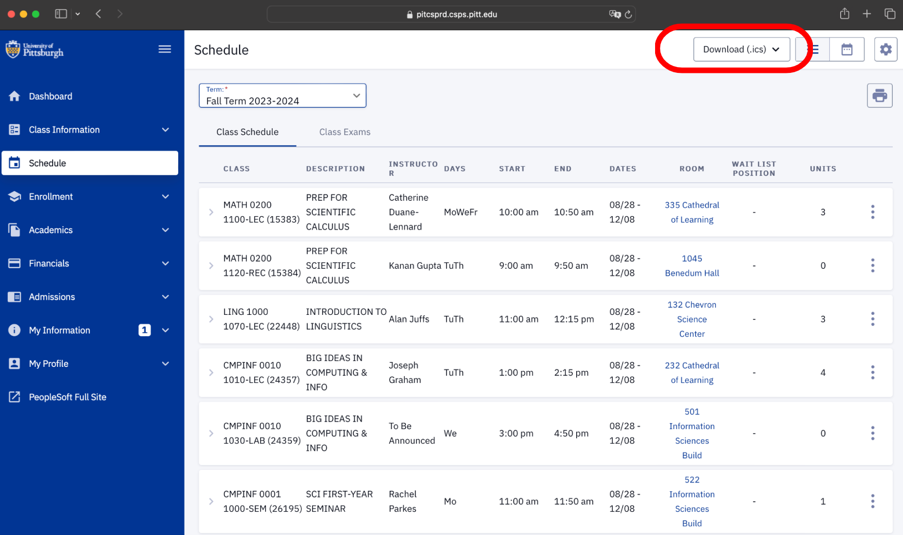

# Rate My Schedule (Pitt)
**A Steel Hacks 2024.**

##**Description**

As college students, we often find ourselves struggling to create the perfect class schedule--there are so many factors to account for! Even with the help of Pitt’s ScheduleBuilder, it’s difficult to gauge the practicality of your schedule--do you have enough time to walk between your classes? Did you choose your professors wisely? Have you overloaded yourself with credits? How can you answer so many questions??? Enter Rate My Schedule.

We created Rate My Schedule to deliver a comprehensive report card on the quality of your schedule. Whether you receive an A or an F, Rate My Schedule will calm your nerves, giving you the scheduling insights you need to set yourself up for a great semester!

##**Contributers**

The idea and the project was developed by Aidan McHugh, Vaishu Kusumba, Lena Carson, and James Toscano.

##**How to Use**

1. be a Pitt student! 

Rate My Schedule is designed specifically for Pitt Students--to get started, all you have to do is download your schedule from Peoplesoft. Just navigate to your schedule and use the Download button in the top right. The file type should be .ics.

2. Upload your schedule

After uploading your schedule to Rate My Schedule, for each class you’ll need to enter the professor’s name and the amount of credits it’s worth. 

3. Receive your report!

Like magic, you’ll receive a report card breaking down 3 crucial aspects of your schedule. First, your break times. Rate My Schedule calculates how long your breaks are between classes and compares that information with the time it takes to walk between them. Next, the quality of your professors. Using data from RateMyProfessor, Rate My Schedule assesses other students’ reviews of the professors you’ve chosen. Finally, the amount of credits you’re taking--will you be swamped in work? Don’t worry, Rate My Schedule will let you know!

##**How to Install**

Don't do it.

##**Tools/APIs**

+ Flask
+ Python
+ Javascript
+ Bootstrap
+ Github
+ HTML
+ CSS

